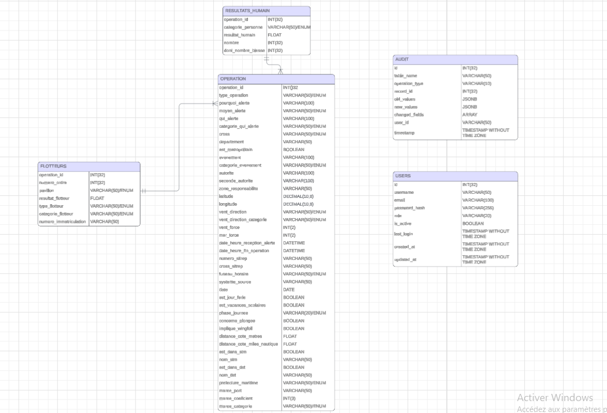

# 🚢 SECMAR - Système de Suivi des Opérations de Sauvetage Maritime

[](https://www.python.org/)
[](https://www.postgresql.org/)
[](https://streamlit.io/)

> **Projet scolaire Data Engineering** — Pipeline ETL, Base de données PostgreSQL et Application Streamlit pour la gestion des opérations de sauvetage maritime.

---

##  Sommaire

- [Contexte du Projet](#-contexte-du-projet)
- [Objectifs et Livrables](#-objectifs-et-livrables)
- [Architecture Technique](#-architecture-technique)
- [Pipeline ETL](#-pipeline-etl)
- [Modèle de Données](#-modèle-de-données)
- [Application Streamlit](#-application-streamlit)
- [Choix Techniques](#-choix-techniques)
- [Installation et Utilisation](#-installation-et-utilisation)
- [Structure du Projet](#-structure-du-projet)
- [Technologies Utilisées](#-technologies-utilisées)

---

##  Contexte du Projet

### La mission

En tant que **Data Engineer junior** au sein du département de suivi des opérations de surveillance et de sauvetage maritime, Nous avons été confronté à une situation critique : suite à des problèmes techniques majeurs, il a fallu **reconstituer et centraliser l'historique des données** des opérations passées.

### Le défi

- Récupérer les données à partir de sauvegardes CSV retrouvées (source : [data.gouv.fr - SECMAR](https://www.data.gouv.fr))
- Centraliser ces données dans un SGBDR robuste
- Créer un outil analytique accessible aux **utilisateurs non techniques** du département
- Prévoir une architecture évolutive compatible avec de futures API

### Notre rôle

Étant les seules personnes techniques du département, Nous avons pris en charge l'ensemble du projet :
- Conception et implémentation du pipeline ETL
- Modélisation et création de la base de données
- Développement de l'interface utilisateur
- Documentation technique complète

---

##  Objectifs et Livrables

| Objectif | Livrable | Statut |
|----------|----------|--------|
| Récupération des données | Module d'extraction automatisé depuis data.gouv.fr | ✅ |
| Nettoyage et validation | Schémas Pandera avec validation configurable (strict/lazy) | ✅ |
| Structuration des données | Modèle relationnel PostgreSQL normalisé | ✅ |
| Chargement en BDD | Pipeline ETL transactionnel | ✅ |
| Analyse et visualisation | Dashboard interactif avec KPIs et graphiques | ✅ |
| Interface CRUD | Application Streamlit pour le métier | ✅ |
| Traçabilité | Système d'audit automatique (triggers) | ✅ |
| Tests | Tests unitaires pytest | ✅ |
| Documentation | Documentation technique complète | ✅ |

---

##  Architecture Technique

```
┌──────────────────────────────────────────────────────────────────────────┐
│                           ARCHITECTURE GLOBALE                           │
└──────────────────────────────────────────────────────────────────────────┘

  ┌─────────────┐     ┌─────────────┐     ┌─────────────┐     ┌─────────────┐
  │data.gouv.fr │────▶│  EXTRACTION │────▶│ VALIDATION  │────▶│ CHARGEMENT  │
  │   (CSV)     │     │  (Requests) │     │  (Pandera)  │     │  (pandas)   │
  └─────────────┘     └─────────────┘     └─────────────┘     └──────┬──────┘
                                                                     │
                                                                     ▼
┌─────────────────────────────────────────────────────────────────────────────┐
│                              POSTGRESQL                                      │
│  ┌─────────────┐  ┌─────────────┐  ┌─────────────┐  ┌─────────────────────┐ │
│  │ OPERATIONS  │  │  FLOTTEURS  │  │  RESULTATS  │  │   AUDIT (triggers)  │ │
│  │             │  │             │  │   HUMAIN    │  │                     │ │
│  └─────────────┘  └─────────────┘  └─────────────┘  └─────────────────────┘ │
└─────────────────────────────────────────────────────────────────────────────┘
                                         │
                      ┌──────────────────┼──────────────────┐
                      ▼                  ▼                  ▼
               ┌─────────────┐    ┌─────────────┐    ┌─────────────┐
               │ SQLAlchemy  │    │  Raw SQL    │    │  Triggers   │
               │    ORM      │    │ (Analytics) │    │   (Audit)   │
               │   (CRUD)    │    │             │    │             │
               └──────┬──────┘    └──────┬──────┘    └─────────────┘
                      │                  │
                      └────────┬─────────┘
                               ▼
                      ┌─────────────────┐
                      │    STREAMLIT    │
                      │  ┌───────────┐  │
                      │  │ Dashboard │  │
                      │  │   CRUD    │  │
                      │  │   Audit   │  │
                      │  └───────────┘  │
                      └─────────────────┘
```

### Approche hybride ORM / Raw SQL

Un choix technique important a été d'adopter une **approche hybride** pour optimiser les performances :

| Type d'opération | Approche | Justification |
|------------------|----------|---------------|
| CRUD unitaire (GET, INSERT, UPDATE, DELETE) | SQLAlchemy ORM | Gestion des relations, validation des contraintes, transactions |
| KPIs et agrégations | Raw SQL | Performance sur les `GROUP BY`, `COUNT`, `SUM` |
| Évolution temporelle | Raw SQL | Fonctions `DATE_TRUNC`, fenêtrage |
| Export massif | Raw SQL + pandas | Optimisation sur gros volumes |

---

##  Pipeline ETL

### 1. Extraction (`extract.py`)

```python
# Téléchargement automatique depuis l'API data.gouv.fr
# Gestion des erreurs réseau, timeouts, retry
```
- Chargement de la configuration depuis `config.yml`
- Récupération des métadonnées du dataset via l'API
- Téléchargement de tous les fichiers CSV disponibles
- Gestion robuste des erreurs (timeout, HTTP, réseau)

### 2. Validation (`transform.py` + Pandera)

La validation utilise **Pandera** avec deux modes configurables :

| Mode | Comportement | Cas d'usage |
|------|--------------|-------------|
| **Strict** (fail-fast) | Arrêt à la première erreur | Production, données critiques |
| **Lazy** | Collecte toutes les erreurs | Développement, diagnostic |

**Règles de validation appliquées :**
- Types de données (int, string, datetime)
- Valeurs nullables
- Plages de valeurs (coordonnées GPS, dates)
- Valeurs dans des listes prédéfinies (CROSS, types d'opération)

### 3. Chargement (`load.py`)

- Utilisation de `pandas.to_sql()` avec SQLAlchemy
- Transactions automatiques (commit/rollback)
- Mode `replace` ou `append` configurable

---

##  Modèle de Données



### Tables principales

| Table | Description | Clé primaire |
|-------|-------------|--------------|
| **OPERATION** | Table centrale : informations complètes sur chaque opération (localisation GPS, dates, météo, CROSS, type d'événement...) | `operation_id` |
| **FLOTTEURS** | Navires et embarcations impliqués (type, pavillon, résultat) | `operation_id` + `numero_ordre` |
| **RESULTATS_HUMAIN** | Bilan humain par catégorie (équipage, passagers) et résultat (sauvé, blessé, décédé...) | `operation_id` + clé composite |
| **USERS** | Gestion des utilisateurs de l'application (authentification, rôles) | `id` |
| **AUDIT** | Journal automatique des modifications (triggers PostgreSQL) | `id` |

### Système d'audit

L'audit est implémenté via des **triggers PostgreSQL** qui capturent automatiquement toutes les modifications :

```sql
-- Chaque INSERT, UPDATE, DELETE est automatiquement loggé
-- avec les valeurs avant/après, l'utilisateur et le timestamp
```

**Avantage** : Traçabilité garantie même pour les modifications directes en SQL.

---

##  Application Streamlit

L'application est conçue pour des **utilisateurs non techniques** du département.

### Pages disponibles

| Page | Fonctionnalités |
|------|-----------------|
| ** Dashboard** | KPIs temps réel, graphiques interactifs (Plotly), carte des opérations, filtres par période/CROSS/type |
| ** Opérations** | Liste paginée, recherche avancée, vue détaillée, CRUD complet (création, modification, suppression) |
| ** Schéma** | Documentation dynamique de la base de données, diagramme ER |
| ** Audit** | Journal des modifications, filtres, diff avant/après, export CSV |

### Système de rôles

| Rôle | Permissions |
|------|-------------|
| `viewer` | Lecture seule |
| `editor` | Lecture + création + modification |
| `admin` | Tous les droits + gestion des utilisateurs |

---

##  Choix Techniques

### Pourquoi PostgreSQL ?
- Support natif **JSONB** pour stocker les anciennes/nouvelles valeurs dans l'audit
- **Triggers** pour l'automatisation de l'audit
- Excellentes performances sur les agrégations
- Robustesse et compatibilité cloud (Render, AWS RDS...)

### Pourquoi SQLAlchemy 2.0 ?
- Style déclaratif moderne (`Mapped`, `mapped_column`)
- Typage natif Python pour une meilleure intégration IDE
- Gestion automatique des sessions et transactions
- `joinedload` pour éviter les problèmes N+1

### Pourquoi Pandera ?
- Validation **déclarative** des DataFrames
- Schémas lisibles en YAML
- Mode **lazy** pour collecter toutes les erreurs (diagnostic facilité)
- Messages d'erreur détaillés

### Pourquoi Streamlit ?
- Développement rapide en **Python pur** (pas de HTML/CSS/JS)
- Widgets interactifs intégrés
- Intégration native avec pandas et Plotly
- `st.dialog` pour les formulaires CRUD

---

### Prérequis

- Python 3.10+
- PostgreSQL 14+

##  Structure du Projet

```
secmar/
├── config/
│   └── config.yml              # Configuration centralisée (URLs, schémas de validation)
├── src/
│   ├── etl/
│   │   ├── extract.py          # Téléchargement depuis data.gouv.fr
│   │   ├── transform.py        # Transformations et validation Pandera
│   │   ├── load.py             # Chargement PostgreSQL
│   │   └── pipelines.py        # Orchestration du pipeline
│   ├── database/
│   │   ├── connection.py       # Context manager pour les sessions
│   │   ├── models.py           # Modèles SQLAlchemy (ORM)
│   │   ├── crud.py             # Classes CRUD génériques et spécialisées
│   │   ├── raw_queries.py      # Requêtes SQL pour analytics
│   │   ├── audit.py            # Fonctions d'audit
│   │   └── enums.py            # Valeurs de référence (CROSS, types...)
│   └── auth/
│       └── authentificator.py  # Authentification et gestion des rôles
├── app/
│   └── pages/
│       ├── 1_Dashboard.py      # Dashboard analytique
│       ├── 2_Operations.py     # Interface CRUD
│       ├── 3_Schema.py         # Documentation BDD
│       └── 4_Audit.py          # Journal d'audit
├── tests/
│   └── test_*.py               # Tests unitaires pytest
├── docs/
│   └── images/
│       └── MCD_maritime.png    # Modèle conceptuel de données
├── requirements.txt
└── README.md
```

---

##  Technologies Utilisées

| Composant | Technologie | Version |
|-----------|-------------|---------|
| Langage | Python | 3.10+ |
| Base de données | PostgreSQL | 14+ |
| ORM | SQLAlchemy | 2.0 |
| Validation | Pandera | 0.17+ |
| Interface | Streamlit | 1.28+ |
| Visualisation | Plotly Express | 5.18+ |
| Tests | pytest | 7.4+ |
| HTTP | Requests | 2.31+ |

---

##  Ressources

- [Documentation SECMAR officielle](https://mtes-mct.github.io/secmar-documentation)
- [Données SECMAR sur data.gouv.fr](https://www.data.gouv.fr)
- [Documentation Streamlit](https://docs.streamlit.io)
- [Documentation SQLAlchemy 2.0](https://docs.sqlalchemy.org)
- [Documentation Pandera](https://pandera.readthedocs.io)

---
